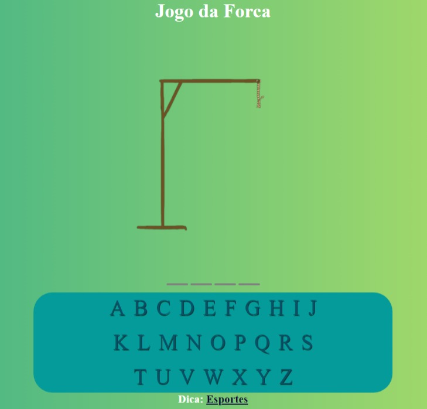

<h1 align="center"> Jogo da Forca </h1>

O jogo da forca foi produzido em conjunto em um trabalho escolar, que consistia em fazer um site simples em JavaScript  

  <a href="#-tecnologias">Tecnologias</a>&nbsp;&nbsp;&nbsp;|&nbsp;&nbsp;&nbsp;
  <a href="#-projeto">Projeto</a>&nbsp;&nbsp;&nbsp;|&nbsp;&nbsp;&nbsp;
  <a href="#memo-licença">Licença</a>

  

 

  

## 🚀 Tecnologias

Esse projeto foi desenvolvido durante um trabalho escolar com as seguintes tecnologias:

- HTML e CSS
- JavaScript
- Github

## 💻 Projeto

Esse é um projeto Web de um Jogo da Forca simples

- [Visite o projeto online](https://KaikMcpe12.github.io/Jogo_da_Forca)

## 📝 Licença

Esse projeto está sob a licença MIT.

---

Feito by Crystian,Devlin,Filipe,Kaik,Miguel